# Hangman

# Introduction

# Project Aim
Welcome to a website dedicated to playing the popular childhood game Hangman. The user essentially guesses what letters are contained in a word, which has been randomly selected by the computer.

[Visit the Website Here](https://grawnya.github.io/hangman/)

[Visit the Project's GitHub Repository Here]( https://github.com/Grawnya/hangman)

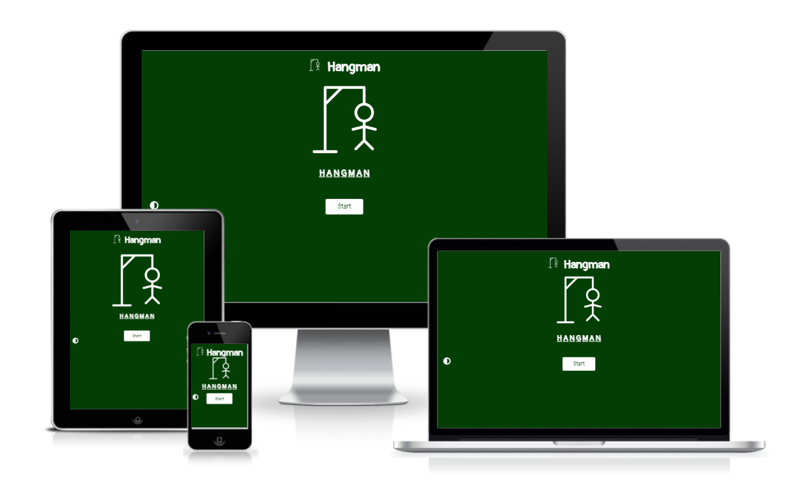

# Table of Contents

* [UX](#ux "UX")
    * [User Goals](#user-goals "User Goals")
    * [User Stories](#user-stories "User Stories")
    * [User Requirements and Expectations](#user-requirements-and-expectations)
        * [Requirements](#requirements)
        * [Expectations](#expectations)
    * [Design Choices](#design-choices "Design Choices")
        * [Font](#font "Font")
        * [Icons](#icons "Icons")
        * [Colours](#colours "Colours")
        * [Structure](#structure "Structure")
* [Wireframes](#wireframes "Wireframes")
* [Features](#features "Features")
    * [Existing Features](#existing-features "Existing Features")
        * [Home Page](#home-page "Home Page")
        * [Game Screen](#game-screen "Game Screen")
        * [Game Winner Modal Boxes](#game-winner-modal-boxes "Game Winner Modal Boxes")
        * [Game Loser Modal Boxes](#game-loser-modal-boxes "Game Loser Modal Boxes")
        * [Light Mode](#light-mode "Light Mode")
    * [Features to be Implemented](#features-to-be-implemented "Features to be Implemented")
* [Technologies Used](#technologies-used "Technologies Used")
    * [Languages](#languages "Languages")
    * [Tools](#tools "Tools")
* [Testing](#testing "Testing")
    * [Code Validation](#code-validation "Code Validation")
        * [W3C HTML Validator](#w3c-html-validator "W3C HTML Validator")
            * [First Attempt](#first-attempt-html "First Attempt")
            * [Final Attempt](#final-attempt-html "Final Attempt")
        * [W3C CSS Validator](#w3c-css-validator "W3C CSS Validator")
            * [First Attempt](#first-attempt-css "First Attempt")
        * [JSHint](#jshint "JSHint")
            * [Final Attempt](#final-attempt-js "Final Attempt")
    * [Lighthouse](#lighthouse "Lighthouse")
        * [Final Attempt](#final-attempt-lighthouse "Final Attempt")
    * [Responsiveness](#responsiveness "Responsiveness")
    * [Web Aim Contrast Checker](#web-aim-contrast-checker "Web Aim Contrast Checker")
    * [Browser Compatibility](#browser-compatibility "Browser Compatibility")
    * [Manual Testing](#manual-testing "Manual Testing")	
    * [Testing User Stories](#testing-user-stories "Testing User Stories")
* [Bugs](#bugs "Bugs")
    * [Resolved](#resolved "Resolved")
        * [Letters Not loading When Clicked](#letters-not-loading-when-clicked "Letters Not loading When Clicked")
        * [Console Error for Selecting the Wrong Letters Before Anything is Clicked](#console-error-for-selecting-the-wrong-letters-before-anything-is-clicked "Console Error for Selecting the Wrong Letters Before Anything is Clicked")
        * [Setting off the Wrong Function when Filling in the Winning Modal Box Form](#setting-off-the-wrong-function-when-filling-in-the-winning-modal-box-form "Setting off the Wrong Function when Filling in the Winning Modal Box Form")
        * [Page Would Refresh Every Time the Winning Form was Filled in](#page-would-refresh-every-time-the-winning-form-was-filled-in "Page Would Refresh Every Time the Winning Form was Filled in")
    * [Unresolved](#unresolved "Unresolved")
* [Deployment](#deployment "Deployment")
* [Credits](#credits "Credits")
    * [For Code Help and Advice](#for-code-help-and-advice "For Code Help and Advice")
    * [For Content](#for-content "For Content")
    * [For Code](#for-code "For Code")

# UX

## User Goals
* Easy to navigate around
* All content remains centrally located on the device screen
* Quick flowing game with no interruptions or slow loading times
* Simple change between light and dark mode
* Clear knowledge of which letters pressed are right or wrong

## User Stories
* As a user, I want to easily interact with the game.
* As a user, I want to know how to play the game.
* As a user, I want to play a game that is not slow to run.
* As a user, I want to know if the letter I selected is in the word or not in the game.

## User Requirements and Expectations
### Requirements
* Easy to navigate on the different screen sizes – mobile, tablet and larger screens.
* Present basic introductory sentence to play the game.
* Let the user know if the letter they select is contained within the word or not.
* Entice the user to play again with aesthetically pleasing modal boxes.

### Expectations
* I expect the game to flow nicely with a clear, logical progression of the game.
* I expect the website to be completely responsive to all screen sizes
* I expect to set up the form if the user wins, so that it has to be correctly filled out in order for it to be successfully submitted and used to manipulate the DOM.
* I expect the user to utilise the dark/light mode functionality of the website throughout the game.

\
&nbsp;
[Back to Top](#table-of-contents)
\
&nbsp;

## Design Choices
### Font
To deviate from the standard fonts, [Google Fonts](https://fonts.google.com/ "Google Fonts") was used to obtain a font style, which would be reminiscent of a classroom blackboard. [Pangolin]( https://fonts.google.com/specimen/Pangolin?query=pangolin) fulfilled the criteria for the game’s text, as it was easily readable, yet had that nostalgic childhood vibe.

### Icons
In order to obtain some icons for the website, [Font Awesome](https://fontawesome.com/ "Font Awesome") will be utilised. An icon is only required for the dark/light mode button as the hangman images are all pictures.

### Colours
To select the colour palette for the project, was inspired by a traditional blackboard for the dark mode, and by a whiteboard for the light mode. For dark mode, when checking the contrast of the colours on [Web AIM](https://webaim.org/resources/contrastchecker/ "Web AIM"), the dark green with the white passed. For the light mode, the dark blue with the white also passed. Therefore, the following colours were selected for the project:

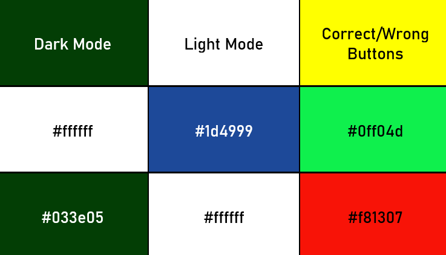

Where:
*  #033e05 (also known as --dark green) is used for the background of the game in dark mode, as well as the font and the button background colour of the modal boxes.
*  #1d4999 is used for the image and fonts of the game in light mode, as well as the background colour of the modal boxes.
*  #ffffff (also known as --white) is used for the images, fonts and modal box background colour in dark mode, but is used for the background of the game, as well as the font and button background in the modal boxes in light mode.
*  #0ff04d is used for the background of the key if it is correct and contained in the word.
*  #f81307 is used for the background of the key if it is wrong and not contained in the word.

### Structure
The website will be built for a small mobile screen of width 320px and then will also meet the requirements for a medium/tablet and large screen, as shown in the table below.

| Screen Size   | Breakpoint |
| -----------   | ---------- |
| small/mobile  |    320px   |
| medium/tablet |    768px   |
| large         |   992+px   |

\
&nbsp;
[Back to Top](#table-of-contents)
\
&nbsp;

# Wireframes
[Balsamiq](https://balsamiq.com/wireframes/ "Balsamiq") was used to create the conception for the website appearance and flow. I initially created a mobile version in-line with my mobile-first approach and then followed with a medium and large screen version. The key is to make sure that the whole game could fit on the one screen and no scrolling is required.

Basic wireframes can be found below:

### [Large Screen Wireframe](documentation/large-screen.png "Large Screen Wireframe ")
### [Medium/Tablet Screen Wireframe]( documentation/tablet-screen.png " Medium/Tablet Screen Wireframe ")
### [Mobile Wireframe]( documentation/small-mobile-screen.png "Mobile wireframe")

\
&nbsp;
[Back to Top](#table-of-contents)
\
&nbsp;

# Features

## Existing Features
### Home Page
The home page consists of a basic and enticing central hangman image, reminiscent of school days, to lure the user in. The colour scheme reinforces this. The title at the top of the page highlights that the game being played will be hangman. 

The start button’s large design entices the user to click on the button. Below the centrally located start button, the user can find a brief introduction into how the game will function.

This can be seen in the screenshot below:

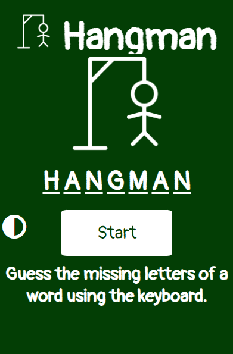

The larger screen sizes include room either side of the game so the image maintains its aspect ratio and the game is not stretched out. 
\
&nbsp;

### Game Screen
The game screen is the screen of most importance in the game as the user spends most of their time here when on the website. The game automatically begins by clearing the default letters HANGMAN, as well as removing the start button, hangman image and the introductory sentence. A keyboard is also introduced at the bottom of the screen, which is ideal for mobile or tablet users, who might not have an external keyboard.

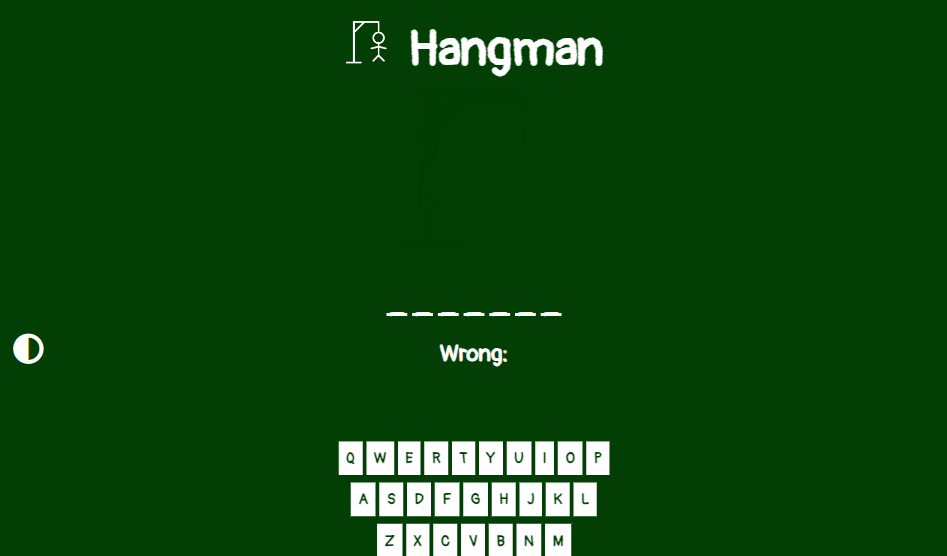

As the game progresses, the correct letters (i.e., the letters contained within the word) are included in the letters underlined on the screen and the associated key on the keyboard turns green.
If the wrong letter is selected (i.e., a letter not found in the word) it is pasted underneath the word in the “Wrong” section and the key associated with the letter turns red on the keyboard, as seen below. The image also changes to add a body part to the hangman.

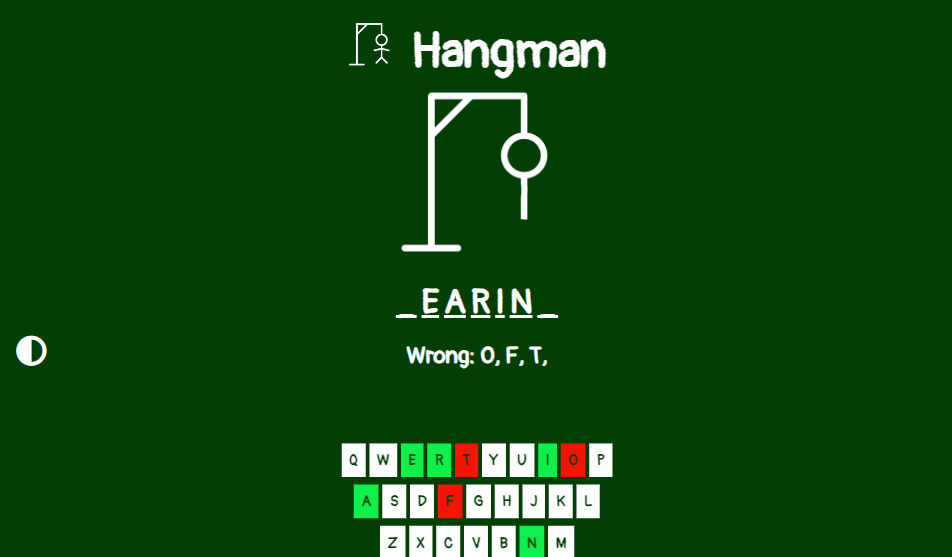

The user can continuously click on or press down keys until one of the 2 criteria are met to end the game:
1. The user has selected all the letters found in the word and therefore has won or
2. The user has selected 7 wrong letters and therefore, has ran out of option to select a new letter and has lost.

Both options prompt the appearance of modal boxes.
\
&nbsp;

### Game Winner Modal Boxes
If the user is successful, 2 modal boxes will appear, one after another. The first one prompts the user to put in their username, as seen below:

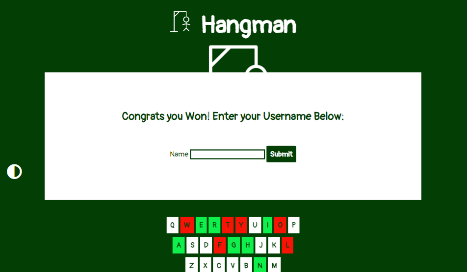

After the user has put in a username (or if they want to rename anonymous, they can leave it blank), the second modal box will pop up to let them know the number of wrong answers made until they got the right answer:

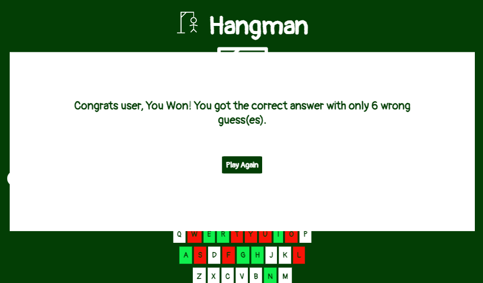

The user is also prompted to select the play again button, which brings them to the game screen and starts the game again.
\
&nbsp;

### Light Mode
An addition of the game includes the use of a light mode – making the website itself look like a whiteboard. It can be used at the start of the game or the user can swap seamlessly throughout the game by pressing the icon located on the left hand side of the page. Similar to the dark mode, the start page essentially just swaps around the 2 primary colours.

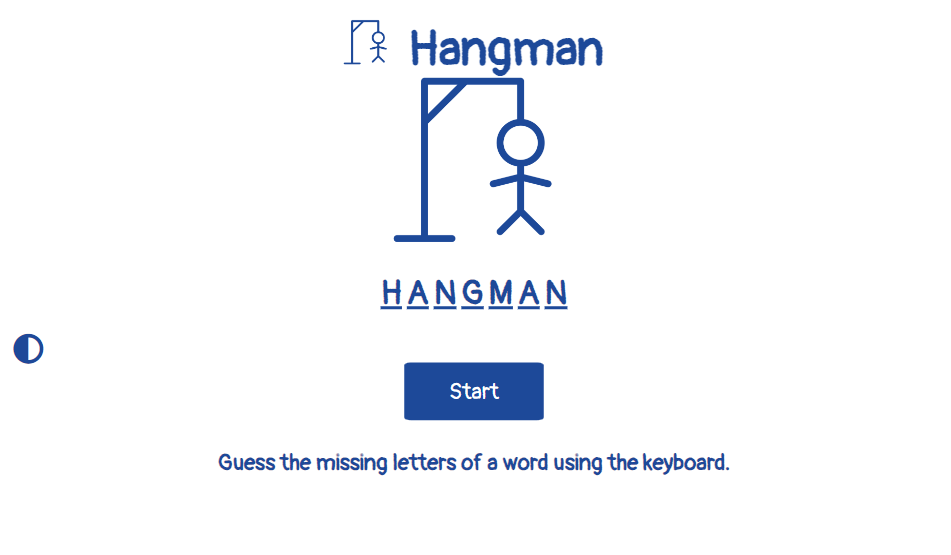

The user can swap back to dark mode by just clicking on the icon again. As the user continues to play the game, the game page follows the same rules in both light and dark mode as seen below:

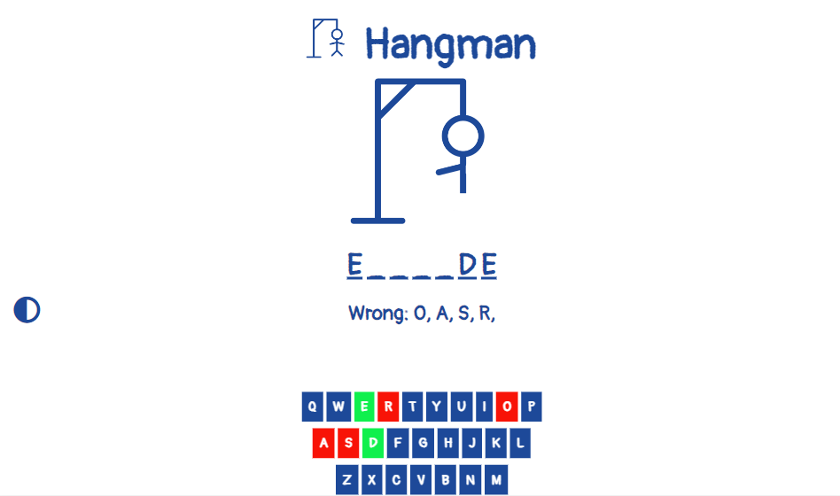
\
&nbsp;

## Features to be Implemented
* A locally leaderboard section to allow any user who plays the game on the device, to be ranked against people who are playing the game as well on that same device.
* A global leaderboard to compete against users online.
* Saving the time taken to solve the word and then using that as a ranking feature for the leaderboard.

\
&nbsp;
[Back to Top](#table-of-contents)
\
&nbsp;

# Technologies Used

## Languages
* [HTML](https://en.wikipedia.org/wiki/HTML "HTML")
* [CSS](https://en.wikipedia.org/wiki/CSS "CSS")
* [JavaScript](https://en.wikipedia.org/wiki/JavaScript "JavaScript")

## Tools
* [Gitpod](https://www.gitpod.io/ "Gitpod")
* [GitHub](https://github.com/ "GitHub")
* [Font Awesome](https://fontawesome.com/ "Font Awesome")
* [Google Fonts](https://fonts.google.com/ "Google Fonts")
* [Balsamiq](https://balsamiq.com/wireframes/ "Balsamiq")
* [W3C HTML Validation Service](https://validator.w3.org/ "W3C HTML")
* [W3C CSS Validation Service](https://jigsaw.w3.org/css-validator/ "W3C CSS")
* [JSHint](https://jshint.com/ "JSHint")
* [Web AIM](https://webaim.org/resources/contrastchecker/ "Web AIM")
* [Lighthouse](https://chrome.google.com/webstore/detail/lighthouse/blipmdconlkpinefehnmjammfjpmpbjk?hl=en "Lighthouse")

\
&nbsp;
[Back to Top](#table-of-contents)
\
&nbsp;

# Testing

## Code Validation 
### W3C HTML Validator
I validated my HTML at various stages of the website creation using the [W3C HTML Validation Service](https://validator.w3.org/ "W3C HTML"). The various attempts for the [Website](#home-page "Home Page") can be seen below.

#### First Attempt (HTML)
The primary issue that arose in the first attempt occurred when the action of the form was left blank. This was rectified by placing a ‘#’ symbol inside the action and an `event.preventDefault()` command in the associated JavaScript function to prevent the page from reloading when the user would submit their username.

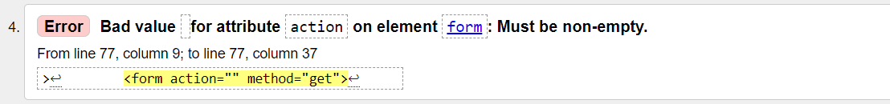

#### Final Attempt (HTML)
No issues arose.

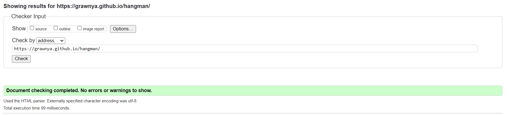
\
&nbsp;

### W3C CSS Validator
I validated my CSS upon completion with [W3C CSS Validation Service](https://jigsaw.w3.org/css-validator/ "W3C CCC"). The attempt for the [Website](#home-page "Home Page") can be seen below.

#### First Attempt (CSS)
No issues arose. 

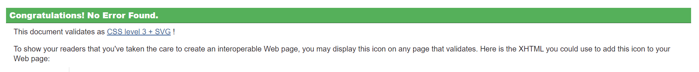
\
&nbsp;

### JSHint
The primary JavaScript document `script.js` was often run through [JSHint](https://jshint.com/ "JSHint") to check for any syntax or declaration errors. Below contains the returned results of the script.

#### Final Attempt (JS)
No issues arose. 

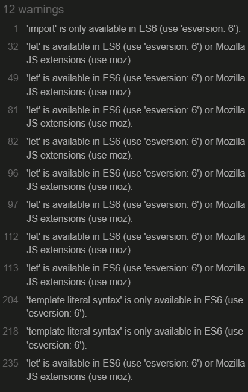
\
&nbsp;

## Lighthouse 
In order to verify the suitability of the webpage, [Lighthouse](https://chrome.google.com/webstore/detail/lighthouse/blipmdconlkpinefehnmjammfjpmpbjk?hl=en "Lighthouse"), a tool found in Chrome Developer Tools was used to check a broad variety. This includes:

* Performance – Based on how fast the website loads and contributes to the overall UX.
* Accessibility – Based on how easy it is to use the website regardless if people might use a screen reader, etc.
* Best Practices – Based on the best practices used in industry.
* SEO - Search Engine Optimisation – If the website is optimised to be easily discoverable on a search engine.

### Final Attempt (Lighthouse)
After completing the project, Lighthouse was used to check the suitability on both the desktop and the mobile version of the game. The following result was obtained for the mobile version of the game, whereas the desktop version earned 100 in all 4 categories.

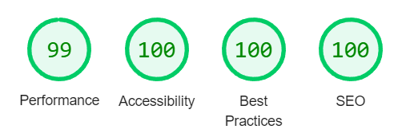
\
&nbsp;

## Responsiveness 
The responsiveness of the design was manually checked using the Chrome Developer Tools for various screens. The manual testing itself will be discussed [here](#manual-testing "Manual Testing").

This included:
* iPhone SE
* Pixel 5
* Samsung Galaxy S8, S20 Ultra
* iPad Air and Mini
* Galaxy Fold
* Nest Hub and Hub Max

I also opted to use the responsiveness option and checked the screens at the following width sizes:
* 320px
* 768px
* 992px

No issues arose, due to the responsive design of the website with rem and % values.
\
&nbsp;

## Web Aim Contrast Checker
The [Web AIM](https://webaim.org/resources/contrastchecker/ "Web AIM") was used, as described in the [Colours](#colours "Colours") section.

For the dark mode, the contrast check between the dark green background with the white passed, as it met the contrast ratio criteria of 7+, as seen below:

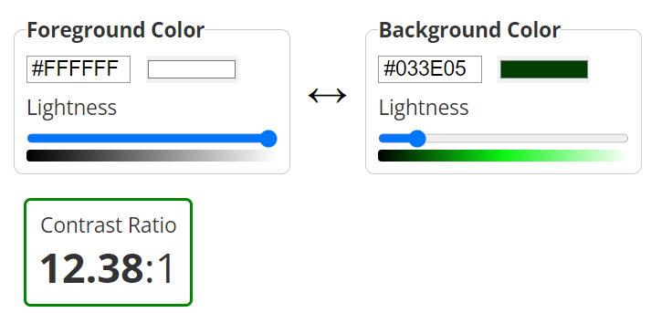

For the light mode, the contrast check between the white background with the dark blue passed, as it met the contrast ratio criteria of 7+, as seen below:

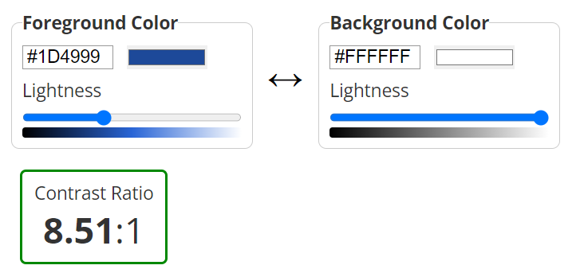
\
&nbsp;

## Browser Compatibility
The website was tested on a variety of browsers to ensure that it was fully functional. 

On desktop, Google Chrome, Mozilla Firefox and Microsoft Edge were utilised. 

On mobile, Google Chrome was utilised.

The responsiveness and the appearance remained relatively the same across the various devices and browsers.
\
&nbsp;

## Manual Testing
As detailed above, the game was played on a variety of browsers and devices. It was also posted into a discord group to be peer reviewed and on the peer-code-review channel on the Code Institute’s Slack.
The following elements were constantly checked and tested to ensure that they wouldn’t break or perform in an unexpected manner when playing the game:

* Home Screen:
	* Verified that clicking the light/dark mode button will change the colour of the screen.
	* Verified that the user can’t start the game or register any keypresses successfully without pressing the start key.
	* Therefore, verified that the hangman image cannot be altered or the game text cannot be removed without going into the console to deliberately alter the game.

* Game Screen:
	* Verified that pressing or clicking the wrong key (i.e., one not contained within the word) will add that letter to a string of wrong letters on the screen.
	* Verified that selecting the wrong key will turn the key background to a shade of red. 
	* Verified that selecting the wrong key will also add a body part to the hangman and therefore, will update the image.
	* Verified that pressing or clicking the right key (i.e., one contained within the word) will add that letter to the letters with an underscore in the middle of the screen.
	* Verified that selecting the right key will turn the key background to a shade of green. 
	* Verified that selecting multiples of a key will not register it as right or wrong if it has been selected once.

* Game Winner Modal Boxes:
	* Verified that if the user wins, the keystrokes for the username input will not trigger the function which states that the user has lost if the username characters are not in the word.
	* Verified that the modal box to congratulate the winner will only appear if the user submits a username or a blank string.
	* Verified that the game can only start again if the user selects the “Play Again” button on the second modal box.

* Game Loser Modal Box:
	* Verified that the game can only start again if the user selects the “Play Again” button on the second modal box.
\
&nbsp;

## Testing User Stories 
1. As a user, I want to easily interact with the game.
	* The design of the website has plenty of features that allow the user to engage with its content. It has buttons, which lead to progression from one stage to another. A keyboard which changes colour based on the right and wrong key input, having a knock-on effect; changing the letters shown on the screen and the hangman image. The light/dark icon for changing the colours of the page encourages interactivity.

2. As a user, I want to know how to play the game.
	* On the home page, there is a short statement on how to play the game – “Guess the missing Letters of a word using the keyboard”. The large start button prompts the user to select it and by selecting keys, the logical progression of the game means that the user will either lose of=r win at some point. These will trigger the modal boxes which will walk the user through playing the game again.

3. As a user, I want to play a game that is not slow to run.
	* This is vital to keep the user interested in the game, especially if they have poor Wi-Fi. The [Lighthouse](#lighthouse "Lighthouse") section highlights that the game has high performance and accessibility results on both phone and desktop, which means that it’ll perform at a reasonably quick pace.

4. As a user, I want to know if the letter I selected is in the word or not in the game.
	* The logic of the game requires the user to know if they have selected a letter within the word, as this will dictate how many guesses they have left. The user is told that their letter selection is wrong if the key they have selected has been added to the “Wrong:” section and the key background has turned red. The hangman image will also add an extra body part. Similarly, if the letter is correct, the letter will be added to the word that the user is trying to solve in the section of underscores and the key will turn green.

\
&nbsp;
[Back to Top](#table-of-contents)
\
&nbsp;

# Bugs

## Resolved
### Letters Not loading When Clicked
**Problem:**
If a letter was pressed down with a key, it would appear in its correct place with an underscore if it was in the word. If the user clicked the key, which is important for most mobile users, any previously correct letters were replaced with underscores.

**Cause:**
The event listener for the start button was not targeted at the start button, but the whole page so anytime the user would click, it would restart the game again.

**Resolution:**
By adding the start game event listener to the start button and by altering the nesting of the functions so they had less of an impact on each other.

**Before:**
\
&nbsp;
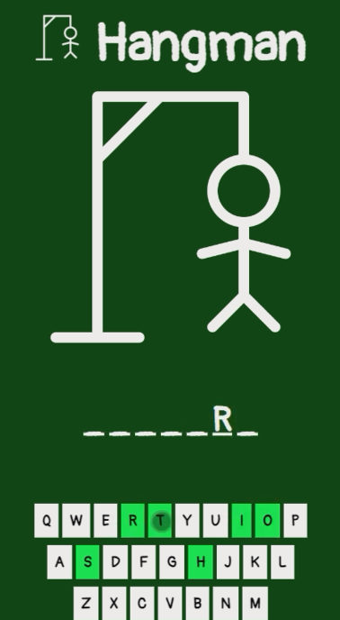

**After:**
\
&nbsp;

### Console Error for Selecting the Wrong Letters Before Anything is Clicked
**Problem:**
Anytime the game was loaded, the console automatically logged an error for the changing of the background of the wrong key to red.

**Cause:**
As no key had been selected, it was deduced that the “null” value appeared due to the function running before the game began.

**Resolution:** 
An `if` statement was added to the function which deduces if a letter is correct or incorrect and if the key element is not equal to null, the code can run.

**Fix:**
\
&nbsp;
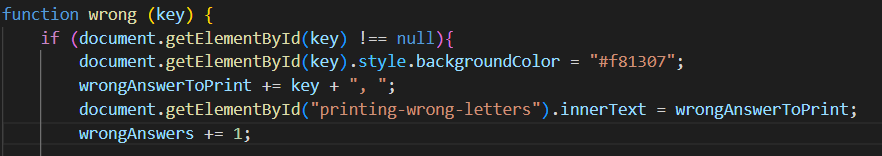

### Setting off the Wrong Function when Filling in the Winning Modal Box Form
**Problem:**
Even if the user won the game, when they began to type in their username into the form, it would still prompt the user to register the letters as incorrect values if the letter was not in the word. Eventually this led to the user losing if they have more letters in their username that were not in the word.

**Cause:**
The `wrong()` function would still set off.

**Resolution:**
Remove the event listener and as a backup, introduce a function `resetEndGameValues()` that would prevent the user from setting off the losing game function unless they had 1000+ incorrect letters in their name that did not appear in the word.

### Page Would Refresh Every Time the Winning Form was Filled in
**Problem:**
Every time the user won the game and they put in their username, as they hit the submit button, it would cause the game to restart.

**Cause:**
The form had an action that would refresh the page every time (i.e., `action = “#“`).

**Resolution:**
Include `event.preventDefault()` action into the function which obtains the username from the form.
\
&nbsp;

## Unresolved
None – but attempted to create a leaderboard, but when running the game nested arrays were obtained as results, which led to the creation of lots of rows in a table rather than only the top 5 results. Due to submission deadline approaching, I opted to leave out feature, but it will be added in the future.

\
&nbsp;
[Back to Top](#table-of-contents)
\
&nbsp;

# Deployment

During the process of coding up the website, the code was deployed on GitHub to allow for continuous manual testing and code validation. The following steps were conducted to deploy the website on GitHub:

1. Commit the code, go to the GitHub repository and select the settings tab in the navigation bar below the repository name.
2. In the left hand side menu, navigate down to the “Code and Automation” section and select the “Pages” option.
3. At the top of the page, there is a “Source” section, with a drop-down menu, prompting the user to select a branch. Select the “main” branch.
4. Press the “Save” button.
5. Wait a few minutes and the website should be deployed at the [link]( https://grawnya.github.io/hangman/) above the “Source” section.
6. Any changes committed after the website has been deployed will cause the website to be updated shortly after they are committed.

\
&nbsp;
[Back to Top](#table-of-contents)
\
&nbsp;

# Credits

## For Code Help and Advice
* [Harry Dhillon](https://github.com/Harry-Leepz)
\
&nbsp;

## For Content
* [Basis for Hangman Images](https://iconbros.com/icons/ib-g-hangman)
* [100 random words](https://randomwordgenerator.com/)

## For Code
* [Keyboard for Game](https://www.freecodecamp.org/news/build-a-wordle-clone-in-javascript/)

\
&nbsp;
[Back to Top](#table-of-contents)
\
&nbsp;